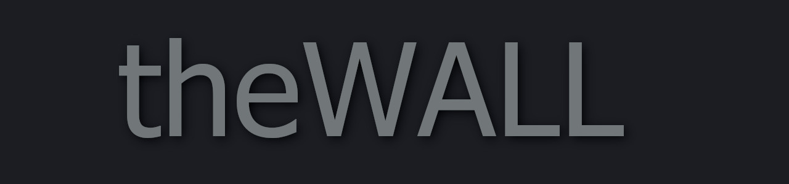

# theWALL

A simple [svelte](https://svelte.dev/) learning experience.

## Motivation

The best way to learn a new thing is to work with sed thing. So here we are. A little svelte application to take the thing for a test ride

## Goal 

Because of the dropping prises of TVs and raspberries there are many monitors/TVs that have nothing to display. For those I have created a little **joke** application to display random humorous facts from the interned and give the monitors a purpose.

## Infrastructure

KISS

### External resources

* Ron Swanson quotes service: http://ron-swanson-quotes.herokuapp.com/v2/quotes
* Urban dictionary word of the day: http://urban-word-of-the-day.herokuapp.com/
* Youtube: https:/youtube.com